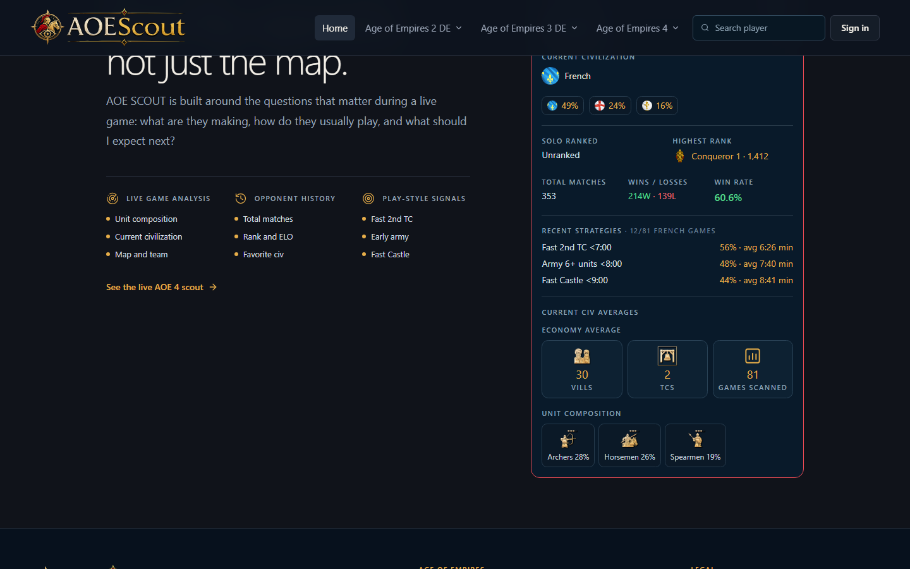
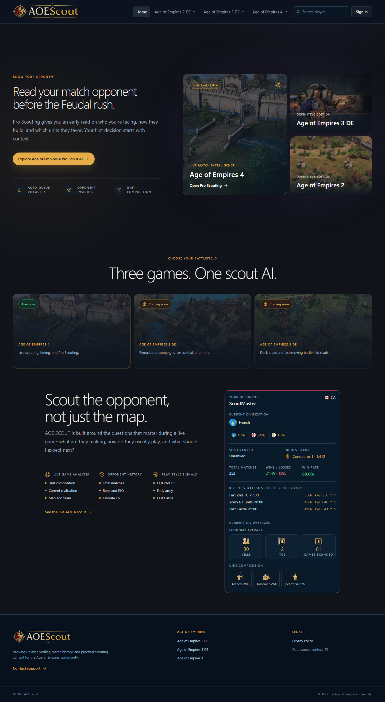

# AOE Scout App — Project Showcase

AOE Scout is a match-intelligence companion for Age of Empires players. It
helps players scout the opponent behind the map by bringing together rank
performance, player history, civilization context, recent strategy signals,
win rate, economy averages, and unit composition in one readable surface.

This repository is the public-facing project showcase for the app. It is
intentionally a static front-end presentation: `index.html` plus product
screenshots. It does not contain the private website application, APIs,
Windows runtime, authentication, data services, build pipeline, or any
cloneable product source code.

## Product goal

Give players useful context before the Feudal rush:

- Understand who they are facing and how that player performs.
- Recognize recent strategies such as Fast 2nd TC, Army 6+ units, and Fast Castle.
- Read timing averages in plain language, including minutes.
- See likely unit pressure without digging through a spreadsheet.
- Keep the visual language consistent between the web app and Windows companion.

## Live product

- Website: [aoescout.com](https://aoescout.com/)
- Pro Scout AI: [aoescout.com/age-of-empires-4/pro-scout-ai](https://aoescout.com/age-of-empires-4/pro-scout-ai)
- Contact / Discord: [aoescout.com/contact](https://aoescout.com/contact)
- Showcase repository: [github.com/talhazahid/aoescoutapp](https://github.com/talhazahid/aoescoutapp)

## Screenshots

### Scout the opponent, not just the map

### AOE Scout homepage

## Repository scope

Only the static showcase belongs here:

- `index.html` — SEO-friendly project presentation with inline responsive CSS.
- `screenshots/` — browser-generated product captures used in the showcase.
- `README.md` — project story, links, and scope boundary.

Do not add backend code, application source, credentials, API integrations,
Windows binaries, private assets, or deployment configuration to this repo.
The working product remains maintained and deployed through the private AOE
Scout application project.

## Local preview

Open `index.html` directly in a browser, or serve this folder with any static
file server. No package installation, build command, or runtime dependency is
required.

## Credits

AOE Scout is built by Talha Zahid for the Age of Empires community. Age of
Empires and its related marks belong to their respective owners.
